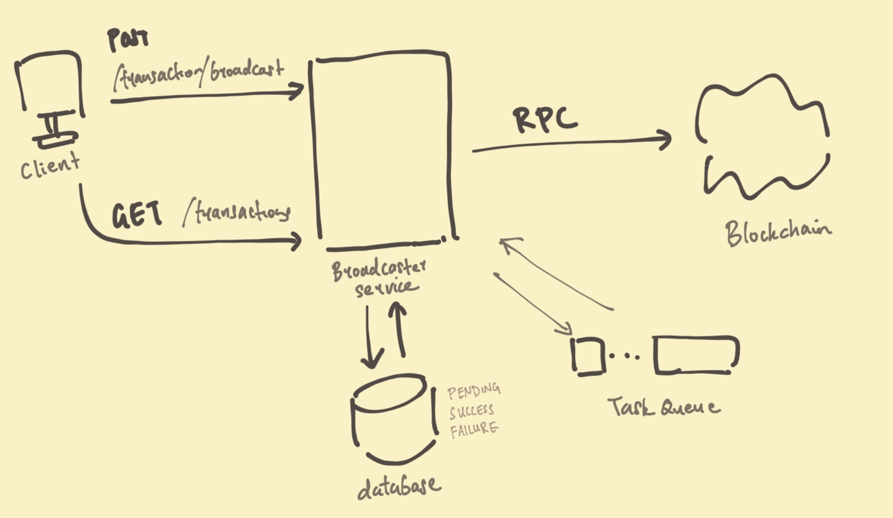

The following diagram shows a high level overview of the components that interact with the broadcaster service. 


Additinally, an authorisation service is needed to check whether the client has admin privileges to retry a failed request. 
The authorisation service can be any authorisation service already in use by the organisation.

In the problem scenario, there are 3 different cases in which the broadcaster service can be invoked:
1. a client sending a broadcast request
2. an admin sending a retry request
3. a client requesting for a list of transactions

A simple way to handle the different request is to have separate endpoints for each case.

```golang
http.HandleFunc("/transaction/broadcast", handleBroadcastRequest)   // POST
http.HandleFunc("/transaction/retry", handleRetryRequest)           // POST
http.HandleFunc("/transactions", handleGetRequest)                   // GET
```
Each request will generate an asynchronous task, so that tasks can yield when it is blocked waiting for IO. 
No synchronisation is required as the blockchain is assumed to have its own synchronisation mechanism and most transactional database engines have synchronisation built in.

There is a task queue managing broadcasting to the blockchain. The broadcast service will poll from this queue to get transactions to broadcast to the blockchain. 
Each transaction is given 30s to run. If broadcast fails or exceeds 30s, the task will be added to the back fo the qeueue. The servce will then move on to the next task.  

```javascript
async taskLoop() {
    while (true) {
        client, signed_transaction = task_queue_dequeue()

        if (await db_get(signed_transaction).status == SUCCESS) {
            continue;
        } else if (is_transaction_broadcasted_on_blockchain(signed_transaction)) {
            await db_update(signed_transaction, SUCCESS)
            continue;
        }

        status = await broadcast_to_blockchain_30s(signed_transaction)
        await db_update(signed_transaction, status)
        if (status == FAILURE) {
            await task_queue_enqueue(client, signed_transaction)
        }
    }
}
```

### Case 1: Client sending a broadcast request
After receiving a POST request from the client, the broadcaster will perform the broadcast in 4 steps. The steps are carried out sequentially, which means that if any step fails, the function will return.

```javascript
async handleBroadcastRequest(client, data) {
    signed_transaction = sign(data)

    await task_queue_enqueue(client, signed_transaction)

    await db_update(signed_transaction, PENDING)

    // Reply client with HTTP OK
    await reply_client(client, signed_transaction)
}
```

### Case 2:  Admin  sending a retry request
This case is similar to the first one, except that the the authorisation level of the client needs to be checked, and the signed_transaction in the db is sent instead of data. 

```javascript
async handleRetryRequest(client, authorisation, signed_transaction) {
    // Check authorisation level
    actual_auth = await get_auth(client)
    if (authorisation != actual_auth) {
        reply_client(client, error(NOT_AUTHORISED)) 
        return
    }

    // Get transaction and check state
    signed_transaction, state = await db_get(signed_transaction)
    if (state != FAILURE) {
        reply_client(client, error(NOT_FAILURE)) 
        return
    }

    await task_queue_enqueue_front(signed_transaction);

    // Reply client with HTTP OK
    await reply_client(client, signed_transaction)
}
```

### Case 3:  Client requesting for a list of transactions
In this case, the broadcaster service will simply retrieve the list of transactions and return it to the client. 
Before responding to the client, there is also an intermediate step to first process list contents.

```javascript
async handleGetTransactionsRequest(client) {
    // 1. Get list of transactions
    transaction_list = await db_get()
    // 2. Process transaction list
    processed_list = process(transaction_list)
    // 3. Reply client
    await reply_client(client, processed_list)                     
}
```

